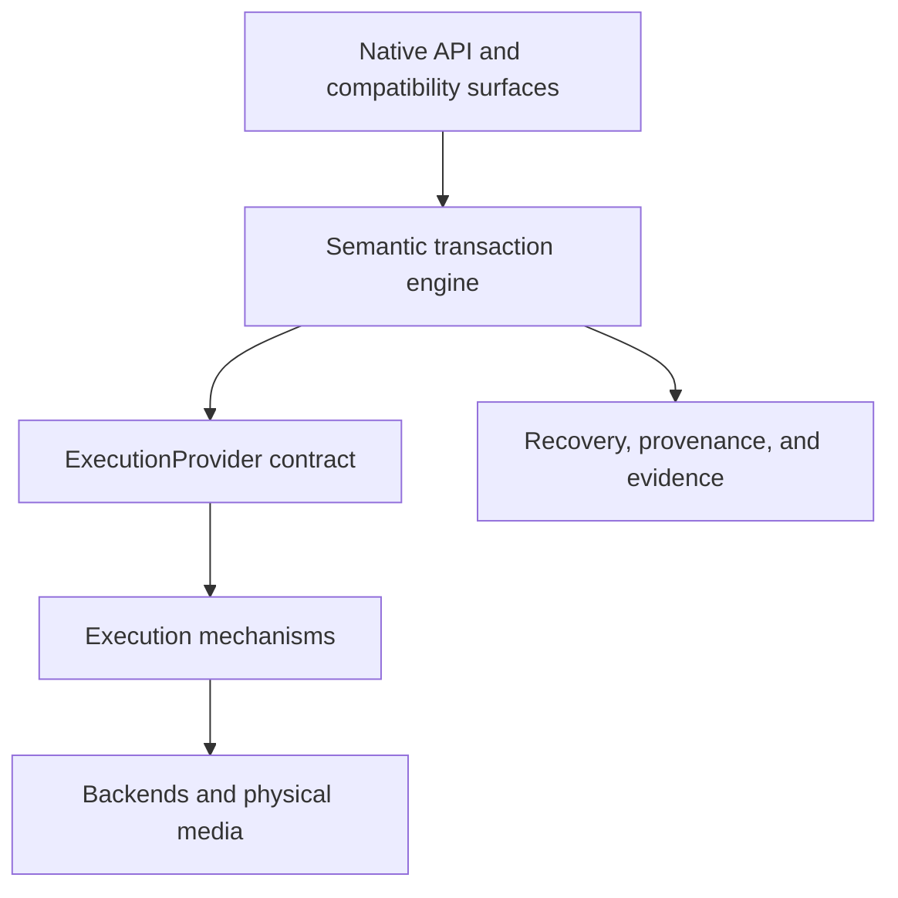
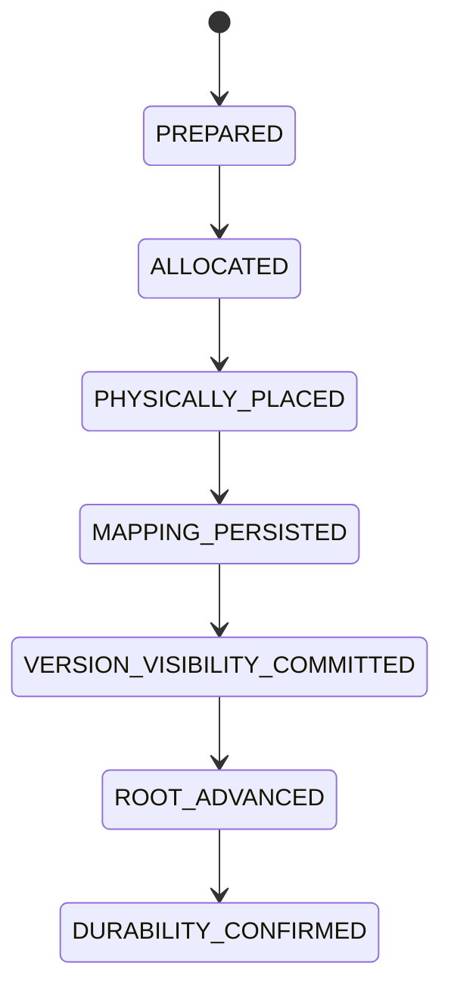
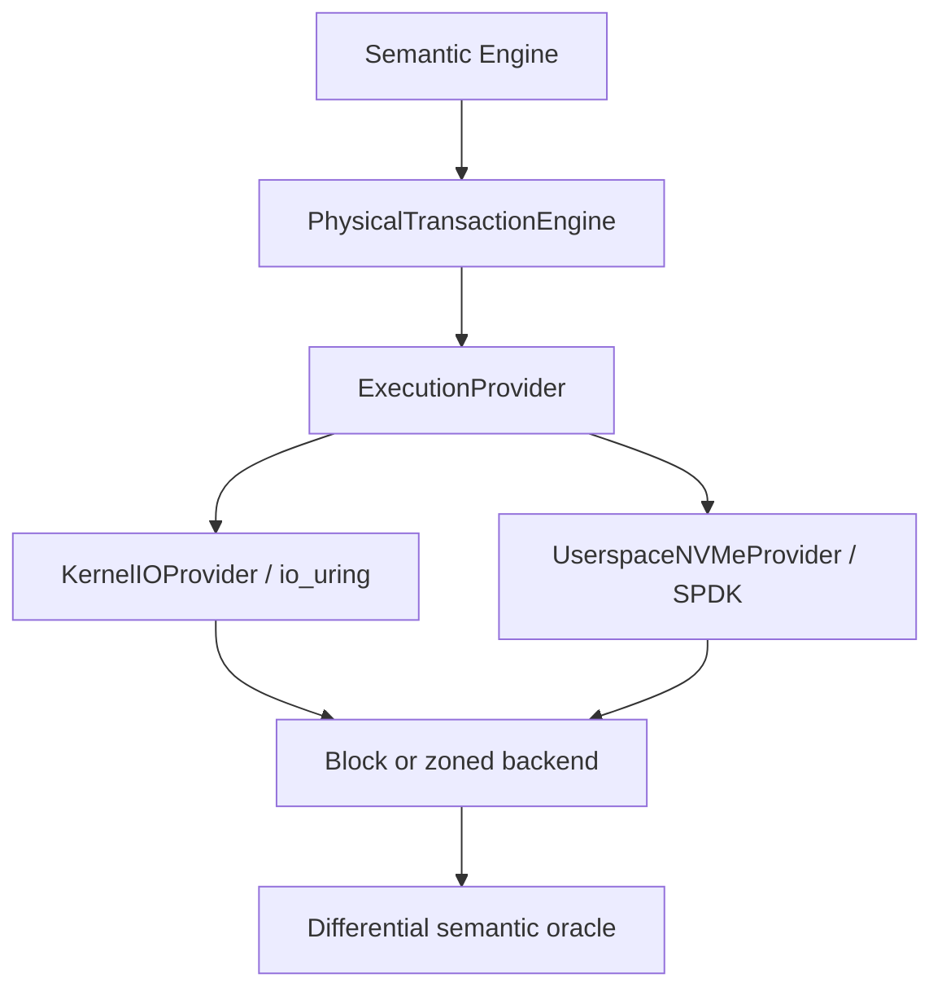

# UASA Comprehensive Research Review and Critical-Evaluation Packet

**Canonical name used in this packet:** Universal Architecture Storage Abstraction (UASA)  
**Research snapshot date:** 27 July 2026  
**Current development focus:** Phase 5B — Physical Execution Engine and Zoned Namespace integration  
**Intended reader:** A technically strong reviewer who can assess storage architecture, filesystems, formal methods, crash consistency, security, and NVMe/ZNS integration

---

## 0. What I need from you

I am asking you to conduct a deep, adversarial, research-oriented review of UASA. Please treat this document as a comprehensive handoff, not as proof that every claim is correct.

Your job is to determine:

1. Whether the problem UASA is trying to solve is real and important.
2. Whether its semantic architecture is internally coherent.
3. Whether its claimed differentiation from existing filesystems and storage systems is genuine, useful, and publishable.
4. Whether the formal and differential verification performed so far supports the conclusions being drawn from it.
5. Whether the current Phase 5B physical-execution design can preserve semantic correctness when integrated with Linux `io_uring`, SPDK, NVMe, and Zoned Namespaces.
6. Which parts are implementable now, which require integration research, which remain theoretical, and which should be rejected or redesigned.
7. What evidence would be required before UASA could credibly be called production-ready, high-performance, secure, portable, or “universal.”

Please challenge assumptions, identify contradictions, and compare against the strongest existing systems. I do not want reassurance or architectural flattery. I want the design made harder to fool.

---

## 1. Evidence status and honesty boundary

This packet combines three kinds of material:

- **Reported UASA project results:** Results carried forward from the project’s specification, formal-model, reference-semantics, and Phase 5B handoffs.
- **Externally verifiable facts:** Facts cross-checked against standards, official documentation, or primary research sources.
- **Analysis and hypotheses:** Conclusions about potential value, novelty, risks, and future performance that still require evaluation.

An important limitation applies: the UASA repository is not currently available in the workspace from which this packet was prepared. Therefore, the claimed files, tests, state counts, and passing gates listed below are **reported project state**, not independently reproduced results in this review session.

The reviewer should request the repository, exact commits, test commands, machine configuration, logs, model-checker output, and benchmark artifacts before accepting implementation-level claims.

### Claims that are currently supportable

- UASA has a coherent specification-first research direction.
- Its reported semantic model includes stable object identity, versions, roots, snapshots, visibility, obligations, orphan handling, and reclamation rules.
- Its reported formal model and reference implementation have undergone bounded model checking, conformance testing, metamorphic testing, and differential comparison.
- Its Phase 5B provider design is consistent with real `io_uring`, SPDK, and ZNS concerns such as asynchronous completion, buffer lifetime, qpair ownership, zone limits, returned append placement, and unknown outcomes.
- Its current architecture contains several potentially valuable combinations of known techniques.

### Claims that are not yet supportable

- That UASA is a complete mountable filesystem.
- That it is production-ready.
- That its implementation has been formally verified.
- That it is faster, safer, more storage-efficient, or more scalable than ext4, XFS, Btrfs, OpenZFS, APFS, ReFS, Ceph, F2FS, ZenFS, or other mature systems.
- That it works correctly on real NVMe ZNS hardware under controller reset or power loss.
- That its security model has been formally validated or independently audited.
- That it is universal across local, distributed, object, block, zoned, removable, embedded, and cloud storage.
- That its research contribution is novel enough for publication or patenting without a formal literature and prior-art review.

In short: UASA is presently best described as a **specification-first storage architecture with a tested reference semantic core and an emerging physical execution layer**, not yet as a finished universal filesystem.

---

## 2. Executive summary

UASA is an attempt to redesign storage around a stable semantic contract instead of around a particular disk layout, kernel filesystem, device type, or cloud API.

The central idea is:

> Logical storage meaning should remain stable even when physical execution mechanisms, storage backends, and media change.

UASA separates:

1. **Semantic identity and state** — what objects, versions, namespaces, roots, snapshots, obligations, visibility, and durability mean.
2. **Transaction and recovery semantics** — when a change becomes visible, committed, root-reachable, durable, recoverable, or reclaimable.
3. **Execution providers** — how asynchronous requests are submitted and completed using a particular mechanism such as a reference backend, Linux `io_uring`, or SPDK.
4. **Physical placement** — where bytes actually land on conventional block devices, ZNS devices, object stores, or future backends.
5. **Evidence** — what was directly observed, what was inferred, and what level of testing supports a claim.

The architecture is designed to prevent a backend from quietly redefining semantics. An execution provider can report capabilities and physical completions, but it is not allowed to decide that an object is committed, visible, durable, or root-reachable.

The current research frontier is NVMe Zoned Namespace integration. Zone Append creates a difficult correctness boundary because the host requests an append to a zone, while the device determines the actual placement. UASA therefore requires the completion’s returned location to become explicit `PlacementEvidence`, from which a `PhysicalPlacement` is derived and durably mapped before the corresponding version becomes visible.

The intended transaction order is:

```text
PREPARED
  → ALLOCATED
  → PHYSICALLY_PLACED
  → MAPPING_PERSISTED
  → VERSION_VISIBILITY_COMMITTED
  → ROOT_ADVANCED
  → DURABILITY_CONFIRMED
```

This ordering is meant to prevent a visible logical version from pointing to unknown, guessed, or unrecoverable physical storage.

UASA’s strongest potential contribution is not any isolated feature. Stable IDs, copy-on-write versions, snapshots, checksums, pluggable backends, capability security, model checking, differential testing, and zoned placement all exist elsewhere. The potentially distinctive contribution is their combination into an architecture where:

- semantics are explicitly separated from execution;
- providers are contractually prevented from mutating semantic state;
- unknown physical outcomes are preserved rather than blindly retried;
- durability claims are bounded by evidence;
- device-returned placement is persisted before visibility;
- backend equivalence is tested through a canonical semantic projection;
- architecture, implementation, and empirical evidence are deliberately kept at different maturity levels.

That is a serious research direction. It is not yet proof of superiority.

---

## 3. Why this research was started

Existing storage systems are excellent within their intended domains, but the broader storage ecosystem remains fragmented along several axes.

### 3.1 Semantic fragmentation

The meaning of “write succeeded,” “durable,” “visible,” “renamed,” “deleted,” “snapshotted,” or “recoverable” varies across:

- local POSIX filesystems;
- copy-on-write filesystems;
- network filesystems;
- distributed object stores;
- cloud APIs;
- database storage engines;
- raw block devices;
- zoned devices;
- userspace NVMe stacks.

POSIX gives applications a common operational interface, but crash outcomes are not fully specified by the interface. Prior research on filesystem crash-consistency models explicitly identifies this gap: applications can observe different post-crash outcomes even when they use the same apparent file operations ([ACM crash-consistency models paper](https://doi.org/10.1145/2872362.2872406)).

### 3.2 Identity fragmentation

Traditional paths are names, not stable identities. Inode numbers are implementation-local and can be reused. Overlay and migration layers can change apparent `(device, inode)` identity; Linux OverlayFS documentation explicitly describes cases where `st_dev` and `st_ino` can vary or fail to provide persistent identity across layers ([Linux OverlayFS documentation](https://docs.kernel.org/filesystems/overlayfs.html)).

This complicates:

- migration;
- synchronization;
- long-lived references;
- snapshots;
- provenance;
- audit trails;
- deduplication;
- cross-backend replication;
- offline or disconnected operation.

### 3.3 Layering fragmentation

Modern systems commonly stack:

```text
Application
→ database/storage engine
→ filesystem
→ volume manager
→ block layer
→ device firmware
→ physical media
```

Each layer may buffer, reorder, retry, compress, cache, replicate, or infer success. A higher layer can therefore mistake request acceptance for persistence, or mistake an I/O error for definite non-execution.

### 3.4 Hardware evolution

Conventional overwrite-oriented block abstractions conceal device behavior. ZNS intentionally exposes sequential-write zones so the host can participate in placement. The current ratified NVM Express ZNS command set is Revision 1.4, and NVM Express describes ZNS as a way to reduce device-side write amplification, over-provisioning, and DRAM while improving tail latency, throughput, and capacity for suitable workloads ([NVM Express ZNS specification page](https://nvmexpress.org/specification/nvme-zoned-namespaces-zns-command-set-specification/)).

This creates opportunity, but it also moves placement and lifecycle responsibilities into host software. A semantic architecture must handle that responsibility without allowing physical behavior to corrupt logical meaning.

### 3.5 Verification fragmentation

Most filesystems rely on extensive testing, fuzzing, assertions, and years of production hardening. Formal verification exists in research systems such as FSCQ, but implementation-level proofs are expensive. FSCQ used Coq and Crash Hoare Logic to prove crash recovery properties of an implementation, and its authors explicitly report that specifications and proofs required substantially more work than the implementation ([FSCQ SOSP 2015](https://adam.chlipala.net/papers/FscqSOSP15/)).

UASA was researched to create a staged path:

```text
Architecture
→ formal model
→ executable reference semantics
→ differential oracle
→ provider conformance
→ real backend
→ hardware evidence
→ fault and power-loss evidence
```

The goal is not to pretend every stage is equivalent. The goal is to make the evidence gap visible.

---

## 4. What UASA is—and is not

### 4.1 UASA is

- A proposed semantic substrate for storage systems.
- A specification-first architecture.
- An object-, version-, root-, and transaction-oriented state model.
- A separation between logical semantics and physical execution.
- A provider contract for asynchronous storage mechanisms.
- A framework for cross-backend semantic equivalence.
- A research platform for conventional block and NVMe ZNS backends.
- A possible future foundation for file, object, database, archival, edge, or distributed storage interfaces.

### 4.2 UASA is not yet

- A demonstrated replacement for Linux VFS.
- A complete POSIX filesystem.
- A production competitor to ext4, XFS, ZFS, Btrfs, APFS, ReFS, or Ceph.
- A distributed consensus protocol.
- A complete RAID or erasure-coding system.
- A proven self-healing storage stack.
- A verified implementation in the FSCQ sense.
- A benchmarked ZNS filesystem.
- A universal solution with no workload trade-offs.

### 4.3 The central research hypothesis

The main hypothesis can be stated as:

> A single storage semantic model can preserve object identity, version history, visibility, transaction ordering, recovery, and reclamation across materially different execution backends without collapsing to an unusably weak lowest-common-denominator contract or imposing unacceptable performance overhead.

This hypothesis has several separable sub-hypotheses:

1. Backend-specific operations can be represented without backend-specific semantics leaking into the logical state model.
2. A provider contract can be strict enough to preserve semantics yet expressive enough for high-performance hardware.
3. Canonical projection can compare backend outcomes without normalizing away meaningful bugs.
4. Device-managed ZNS placement can be reconciled with deterministic recovery.
5. Stable identity can survive renames, versions, snapshots, migration, and backend changes.
6. Explicit evidence levels can prevent unsupported durability and performance claims.
7. The additional metadata and transaction stages will not erase the performance and endurance benefits sought from ZNS.

Each sub-hypothesis needs independent falsification criteria.

---

## 5. Core architectural model



The semantic engine owns meaning. Providers own execution mechanics. Backends own physical behavior.

### 5.1 Semantic plane

The semantic plane reportedly defines:

- objects;
- object identity;
- versions;
- content identity where enabled;
- namespaces and names;
- roots and reachability;
- snapshots;
- visibility;
- transactions;
- obligations;
- orphan versions;
- reclamation eligibility;
- policy and authorization decisions;
- recovery state;
- canonical observable state.

### 5.2 Execution plane

The execution plane reportedly defines:

- physical requests;
- stable physical request IDs;
- request submission;
- asynchronous completion;
- buffer ownership and lifetime;
- queues and queue ownership;
- capability discovery;
- transport- or provider-specific status;
- unknown outcomes;
- durability evidence boundaries.

### 5.3 Physical plane

The physical plane contains mechanisms such as:

- block placement;
- zone allocation and lifecycle;
- Zone Append;
- compression;
- physical checksums;
- replication or erasure coding in future work;
- media-specific alignment;
- persistent logical-to-physical mappings;
- garbage collection or zone reset;
- telemetry from devices and controllers.

The physical plane may optimize representation but must not silently alter logical bytes, identity, version ordering, visibility, or authorization semantics.

### 5.4 Governance plane

The project uses frozen specifications and conformance gates. “Frozen” should mean:

- implementation must conform to the current contract;
- semantic changes require explicit change control;
- an implementation difficulty alone is not permission to weaken an invariant;
- architecture may be reopened only when evidence reveals contradiction, incompleteness, infeasibility, or an unsafe assumption;
- the reason, impact, migration path, and new tests must be recorded.

This is important because architecture drift often occurs when an implementation becomes the de facto specification.

---

## 6. Identity model

The reported identity model is:

```text
Stable Object Identity
+ Optional Content Identity
+ Version Identity
```

These identities answer different questions.

| Identity | Question answered | Required property |
|---|---|---|
| Object identity | “Is this the same logical object?” | Stable across rename, movement, new versions, and backend migration |
| Version identity | “Which state of the object is this?” | Immutable reference to a particular version |
| Content identity | “Are these logical bytes equivalent?” | Derived from canonical content; optional because not every object or security domain should expose it |
| Namespace identity | “Under which name or path is it reachable?” | A binding or projection, not the object’s primary identity |
| Physical placement identity | “Where is this extent currently stored?” | Replaceable and migration-sensitive; never the logical object identity |

### 6.1 Proposed ObjectID

The design selected UUIDv7 as the primary ObjectID form. RFC 9562 defines UUIDv7 as a time-ordered UUID using a Unix-epoch millisecond field plus random or monotonicity-supporting bits ([RFC 9562](https://www.rfc-editor.org/info/rfc9562/)).

Potential benefits:

- decentralized generation;
- good index locality compared with random UUIDs;
- standard representation;
- no dependence on a physical inode or path.

Risks requiring explicit specification and tests:

- clock rollback;
- multiple generators in the same millisecond;
- generator restart;
- privacy leakage from timestamps;
- ordering being mistaken for causality;
- collision handling;
- import of external IDs;
- cross-tenant correlation;
- maliciously constructed identifiers;
- UUID exhaustion or counter rollover behavior.

UUIDv7 provides a format, not a complete identity protocol.

### 6.2 Why content identity is optional

Content hashes can enable:

- integrity verification;
- deduplication;
- cache reuse;
- reproducible artifacts;
- transfer verification;
- content-addressed lookup.

However, content identity can also:

- leak equality of encrypted content;
- create cross-tenant side channels;
- complicate key rotation;
- require canonicalization;
- raise collision and algorithm-agility questions;
- conflate “same bytes” with “same logical object.”

UASA’s separation of ObjectID from content identity is therefore architecturally sound, provided the specification defines:

- hash domain separation;
- canonical byte representation;
- algorithm and version identifiers;
- collision response;
- trust boundaries;
- tenant-scoped versus global deduplication;
- behavior after re-encryption or recompression.

---

## 7. Namespace, roots, versions, visibility, and reclamation

The supplied project history indicates that the semantic core treats names, objects, versions, roots, and physical storage as separate concepts.

### 7.1 Namespace

A namespace binding maps a human- or application-facing name to an object or version reference. The name can change while the object remains the same.

Questions that must be answered by the normative specification include:

- Are hard links supported?
- Can a binding target an object head or an immutable version?
- Are namespace updates transactional across directories?
- What are rename atomicity guarantees?
- Can cycles exist?
- How are case folding, Unicode normalization, forbidden names, and alternate streams handled?
- Can one object appear in several security domains?
- What happens when a backend cannot preserve all metadata?

### 7.2 Versions

Versions provide immutable historical states. A new logical state creates a new version rather than silently changing the identity of the object.

Versioning potentially enables:

- snapshots;
- rollback;
- reproducibility;
- audit trails;
- incremental replication;
- deduplication between versions;
- safe migration;
- ransomware recovery.

It also creates costs:

- metadata growth;
- retention complexity;
- reachability analysis;
- reclamation delay;
- privacy and deletion obligations;
- fragmentation;
- write amplification.

### 7.3 Roots

A root appears to function as a committed reachability anchor. Advancing a root changes which graph of versions is considered current or reachable.

This gives UASA a useful distinction:

```text
Bytes may be physically written
without the version being visible,
and a version may be semantically prepared
without the root being advanced.
```

That separation is central to safe recovery.

### 7.4 Visibility

Visibility should be treated as a semantic event, not inferred from successful I/O submission or even from physical completion.

A version becomes visible only after all prerequisites required by the transaction contract are satisfied. For Phase 5B ZNS work, persistent mapping is one such prerequisite.

### 7.5 Orphans and obligations

The formal and metamorphic test summaries refer to orphan versions, obligations, liveness, and reclamation safety.

The likely intended model is:

- A physically present version may be unreachable or not yet visible.
- Such a version is an orphan candidate, not automatically garbage.
- An obligation records a reason the version or its physical extents must remain available.
- Reclamation is legal only when no root, snapshot, transaction, recovery process, retention policy, replication requirement, or other live obligation can reference the version.

This is a strong design direction because it prevents “unreachable” from being mistaken for “safe to erase.”

The reviewer should verify the exact normative definitions. The above is a semantic interpretation based on the supplied test and model descriptions, not a substitute for reading the actual specifications.

---

## 8. Transaction, durability, and recovery model

### 8.1 Required Phase 5B transaction chain



No step may be skipped.

### 8.2 Why ordering matters

- **PREPARED:** The semantic intent exists, but no physical resource claim is implied.
- **ALLOCATED:** Required logical or physical resources are reserved.
- **PHYSICALLY_PLACED:** A completion provides evidence that bytes obtained a physical location.
- **MAPPING_PERSISTED:** Recovery can reconstruct the logical-to-physical relationship.
- **VERSION_VISIBILITY_COMMITTED:** Readers may observe the version under the transaction’s visibility rules.
- **ROOT_ADVANCED:** The committed reachability frontier moves to include the new state.
- **DURABILITY_CONFIRMED:** The system possesses evidence satisfying the selected durability contract and failure domain.

If visibility precedes durable mapping, a crash can leave a visible version whose bytes cannot be found. If the root advances before the version is committed, recovery can expose partial state. If a completion is lost and the system retries blindly, it can duplicate physical writes or create ambiguous mappings.

### 8.3 Durability contracts

“Durable” must be parameterized. Possible durability claims include:

- accepted into a provider queue;
- completed by the kernel;
- completed by the controller;
- flushed from volatile device cache;
- persisted within one device;
- replicated across devices;
- replicated across hosts;
- persisted across a defined failure domain;
- verified after actual power interruption.

UASA’s `DurabilityContract` and `FailureDomain` model are intended to prevent these meanings from being collapsed into one Boolean.

The key rule should be:

> The system may never claim durability stronger than the evidence it possesses.

### 8.4 Unknown outcomes

An asynchronous request can time out or lose its completion even though the device may have executed it. Therefore:

```text
No completion
≠
definite failure
```

UASA preserves:

```text
PHYSICAL_OUTCOME_UNKNOWN
→ RECONCILIATION
```

rather than blindly retrying.

Reconciliation may require:

- stable request identity;
- zone report inspection;
- mapping journal inspection;
- content checksum matching;
- write-pointer comparison;
- replay-safe idempotency tokens where supported;
- quarantine of ambiguous extents;
- explicit operator intervention for irreducible ambiguity.

The reconciliation algorithm is one of the most important unresolved parts of Phase 5B.

---

## 9. ExecutionProvider contract

The frozen provider contract is reported as `ExecutionProvider Contract v0.1-R1`.

Its invariants are:

```text
INV-EP-001 Semantic Non-Interference
INV-EP-002 Buffer Lifetime
INV-EP-003 Stable PhysicalRequestID
INV-EP-004 Completion Integrity
INV-EP-005 Unknown Outcome Preservation
INV-EP-006 Queue Ownership
INV-EP-007 Durability Evidence Bounds
INV-EP-008 Capability Truthfulness
```

### 9.1 Meaning of each invariant

#### INV-EP-001 — Semantic Non-Interference

A provider must not commit transactions, advance roots, mark versions visible, or mutate lifecycle state. It reports physical facts; the semantic engine interprets them under the frozen contract.

#### INV-EP-002 — Buffer Lifetime

Buffers must remain valid for the entire period in which the provider or device may access them. Completion, cancellation, timeout, and unknown outcome paths must define when ownership returns.

This is not bookkeeping trivia. Use-after-free, premature reuse, or mutation of in-flight buffers can corrupt data without producing a clean I/O error.

#### INV-EP-003 — Stable PhysicalRequestID

Every request needs an identity stable across submission, completion, timeout, tracing, reconciliation, and replay. A queue position is not sufficient because queues wrap and completions can reorder.

#### INV-EP-004 — Completion Integrity

A completion must correspond to exactly the intended request and preserve relevant provider/controller status. Duplicated, mismatched, stale, or fabricated completions must be rejected.

#### INV-EP-005 — Unknown Outcome Preservation

Timeout, process failure, queue failure, or lost completion must not be converted into “definitely not executed.”

#### INV-EP-006 — Queue Ownership

Queue concurrency rules must be obeyed. SPDK documents that a given NVMe qpair may only be submitted to by one thread at a time; qpairs contain no locks or atomics, and violating the rule produces undefined behavior ([SPDK NVMe driver documentation](https://spdk.io/doc/nvme.html)).

#### INV-EP-007 — Durability Evidence Bounds

A provider can report only the durability fact it can actually observe. Kernel completion, controller completion, cache flush, replication, and power-loss survival are not interchangeable.

#### INV-EP-008 — Capability Truthfulness

Capabilities must be discovered or verified, not assumed. Examples include:

- Zone Append support;
- maximum append size;
- maximum open and active zones;
- alignment;
- metadata support;
- flush/FUA semantics;
- queue depth;
- cancellation behavior;
- atomic write properties;
- zoned geometry.

### 9.2 Provider output

Providers return:

```text
PhysicalCompletion
```

They do not return semantic concepts such as:

- committed;
- visible;
- root advanced;
- lifecycle complete.

That boundary is one of UASA’s most important invariants.

---

## 10. Reference, kernel, and userspace execution providers

### 10.1 Reference backend

The reference backend is intended to be simple and deterministic enough to serve as a semantic comparison target. It should favor clarity over maximum performance.

### 10.2 KernelIOProvider

The reported kernel provider uses Linux `io_uring`.

`io_uring` is a Linux asynchronous I/O API based on shared submission and completion rings. It supports batching and can reduce system-call overhead, but it requires careful memory ordering, request tracking, completion handling, and buffer lifetime management ([io_uring manual](https://www.man7.org/linux/man-pages/man7/io_uring.7.html)).

Questions for the implementation:

- Which minimum kernel and `liburing` versions are supported?
- Are buffers registered, provided, copied, or ordinary user buffers?
- How are cancellation races handled?
- How are short writes represented?
- How are CQ overflow and dropped completions handled?
- What is the behavior when a request completes after the transaction timed out?
- Are file descriptors fixed or dynamically resolved?
- Are flush, FUA, and barriers mapped into precise durability evidence?
- Is each provider completion cryptographically or structurally bound to the request record?

### 10.3 UserspaceNVMeProvider

The reported userspace provider uses SPDK.

SPDK provides a userspace, asynchronous, poll-mode NVMe stack with direct device access and lockless thread-per-core design. It can reduce kernel-path overhead but makes application-level resource ownership, polling, thread affinity, DMA-safe buffers, queue lifecycle, and controller recovery critical ([SPDK project](https://spdk.io/)).

Questions for the implementation:

- How are DMA-capable buffers allocated and freed?
- How is qpair ownership enforced rather than merely documented?
- What happens if the polling thread stalls or dies?
- How are controller reset and hot-unplug handled?
- Can completion callbacks re-enter semantic code?
- How are outstanding commands drained during shutdown?
- How are SPDK transport failures mapped without losing “unknown outcome”?
- What is the retry policy for submission failures that occur before the command reaches hardware?

---

## 11. Evidence and telemetry model

The reported evidence ladder is:

```text
EV-0 Architecture
EV-1 Unit Tests
EV-2 Reference Backend
EV-3 Differential Validation
EV-4 Real Hardware Measurement
EV-5 Fault Injection
EV-6 Physical Power-Loss Validation
```

The prefix `EV-` is used in this packet to avoid a serious naming collision discussed below.

### 11.1 Current reported evidence status

| Evidence level | Meaning | Reported status |
|---|---|---|
| EV-0 | Architecture/specification exists | Complete |
| EV-1 | Unit and conformance tests | Complete |
| EV-2 | Reference backend execution | Complete |
| EV-3 | Differential validation | Complete |
| EV-4 | Measurements on real target hardware | Pending |
| EV-5 | Controlled fault injection | Pending |
| EV-6 | Physical power-loss validation | Pending |

### 11.2 Observable versus inferred telemetry

UASA distinguishes:

- **Observed evidence:** Directly returned or measured facts, such as controller status, returned LBA, completion timestamp, zone report, checksum, or flush completion.
- **Inferred evidence:** Conclusions derived from observed facts plus assumptions, such as “likely persisted,” “request probably did not execute,” or “mapping is probably recoverable.”

This distinction should be machine-readable. Every inference should record:

- source evidence IDs;
- inference rule;
- assumption set;
- confidence or certainty class;
- expiration or invalidation condition;
- responsible component;
- timestamp and clock source.

### 11.3 Critical namespace collision

The project currently appears to use `E` labels for at least three different concepts:

1. Evidence levels `E0–E6`.
2. Semantic-equivalence levels `E0–E5`.
3. ZNS Gate E subgates `E1–E8`.

This can produce statements such as “E3 is complete” that are simultaneously true for differential evidence and false for Zone Append implementation.

This should be corrected immediately in documentation:

```text
EV-0..EV-6  = evidence maturity
EQ-0..EQ-5  = semantic-equivalence hierarchy
ZG-E1..ZG-E8 = ZNS Gate E subgates
```

This is not cosmetic. Ambiguous gate naming can corrupt status reporting and research conclusions.

---

## 12. Security, authorization, cryptography, and migration

### 12.1 Authorization model

The selected high-level model is:

```text
Authorization
= Capability
∩ Policy
∩ Context
```

Meaning:

- **Capability:** The caller possesses an unforgeable or validated authority to act on a resource.
- **Policy:** System rules allow the operation.
- **Context:** Current conditions permit it, such as device state, tenant, location, time, risk level, transaction phase, or recovery mode.

This hybrid is potentially stronger and more expressive than any one element alone, but it requires precise semantics for:

- delegation;
- attenuation;
- revocation;
- expiry;
- replay prevention;
- confused-deputy protection;
- context freshness;
- policy versioning;
- authorization caching;
- audit;
- break-glass recovery;
- cross-tenant isolation;
- migration of authority;
- time-of-check/time-of-use races.

The intersection must fail closed, but “fail closed” must not make recovery impossible when ordinary identity infrastructure is unavailable.

### 12.2 Cryptography

The reported specification set includes post-quantum cryptographic agility.

This should be interpreted as a migration and algorithm-agility requirement, not as evidence that UASA is already quantum-resistant. NIST standardized ML-KEM, ML-DSA, and SLH-DSA in FIPS 203, 204, and 205 in August 2024 ([FIPS 203](https://csrc.nist.gov/pubs/fips/203/final), [FIPS 204](https://csrc.nist.gov/pubs/fips/204/final), [FIPS 205](https://csrc.nist.gov/pubs/fips/205/final)).

The storage architecture still needs to specify and evaluate:

- key hierarchy;
- key wrapping;
- algorithm identifiers;
- hybrid classical/PQ modes;
- metadata-size impact;
- signature verification cost;
- key rotation;
- compromised-key recovery;
- crypto erasure;
- snapshot and backup key retention;
- long-term archive verification;
- rollback protection;
- hardware security module integration;
- migration when standards receive errata or parameter updates.

### 12.3 Compression and deduplication

Compression belongs to the physical representation plane unless the API explicitly exposes compressed bytes. The semantic layer should preserve canonical logical content.

Policy should consider:

- per-object compressibility;
- latency budget;
- CPU and energy cost;
- random-access granularity;
- recompression during migration;
- compression bomb protection;
- interaction with encryption;
- content identity before or after compression;
- deduplication leakage;
- garbage-collection amplification.

OpenZFS is a useful warning against assuming that every storage-saving feature is free. Its documentation recommends compression before deduplication because synchronous deduplication can consume substantial RAM and impose heavy lookup costs ([OpenZFS deduplication documentation](https://openzfs.github.io/openzfs-docs/Basic%20Concepts/Data%20Storage/Deduplication.html)).

### 12.4 Migration

The reported specification set includes a migration protocol.

A credible migration protocol must preserve:

- ObjectID;
- version identity;
- namespace bindings;
- roots and snapshots;
- content verification;
- security labels;
- authorization semantics;
- retention and deletion obligations;
- provenance;
- durability contract;
- failure-domain intent;
- rollback capability;
- in-flight transaction state.

It must also define what happens when the destination backend cannot represent a source capability. Valid options include:

- reject migration;
- emulate the capability;
- degrade under explicit user approval;
- preserve inaccessible metadata for round-trip fidelity;
- split data across cooperating backends.

Silent semantic loss should never be an option.

---

## 13. Formal model, executable reference semantics, and cross-validation

### 13.1 Reported frozen specification baseline

The project history reports that 29 specification documents, numbered `00–28`, were written and frozen.

The supplied record identifies subjects including:

- foundational terminology and invariants;
- object, version, and namespace semantics;
- identity;
- roots, snapshots, and visibility;
- obligations, orphan handling, and reclamation;
- transactions, durability, and recovery;
- authorization and security context;
- physical-plane optimization;
- compression policy;
- observability;
- migration;
- formal invariants;
- post-quantum cryptographic agility.

The exact filenames and normative text must be reviewed from the repository. This packet does not invent a document-by-document index that was not available.

### 13.2 TLA+ model

Reported files:

```text
formal/UASA-CORE.tla
formal/UASA-CORE.cfg
formal/README
```

Reported initial model-checking run:

```text
MaxObjects = 3
MaxVersions = 3
68.8 million states generated
4.3 million distinct states
0 invariant violations
```

Reported v0.2 changes:

- `CreateSnapshot` operation added.
- `OrphanVersion` operation added.
- `INV-005`, `INV-020`, and `INV-021` refined.

Reported v0.2 result:

```text
22 invariants passed
788,000 states generated
117,000 distinct states
search depth 21
0 violations
```

The reduction in explored states between runs may be perfectly legitimate due to model changes, bounds, symmetry, constraints, or state representation, but it should be explained in the research artifact.

### 13.3 What this proves—and does not prove

TLC checks a finite instance of a TLA+ specification. Leslie Lamport’s documentation explicitly distinguishes a TLA+ specification from a finite TLC model, such as checking an `N`-process system with `N = 3` ([TLA+ model clarification](https://lamport.azurewebsites.net/tla/model-popup.html)).

Therefore, the correct claim is:

> No violation of the selected invariants was found within the explored bounded model under the stated assumptions and configuration.

The incorrect claim is:

> UASA is formally proven correct for arbitrary objects, versions, failures, concurrency, or implementation behavior.

The model does not automatically prove:

- the Python or systems implementation refines the model;
- device firmware behaves as modeled;
- crashes occur only at modeled boundaries;
- cryptographic assumptions hold;
- unbounded liveness holds;
- the model includes all relevant operations;
- the invariants themselves express every required property.

### 13.4 Reference semantics

Reported reference implementation:

```text
uasa_reference/
```

Reported capabilities:

- executable semantic state transitions;
- invariant assertions;
- deterministic replay;
- snapshots and orphan behavior;
- semantic projections.

Reported baseline:

```text
Reference semantics v0.1.1
23 conformance tests passing
22 executable invariant assertions
```

### 13.5 Referential-stability tests

Reported suite:

```text
test_referential_stability.py
R1–R12
13 tests
```

Reported concerns:

- non-interference between semantic dimensions;
- root stability;
- visibility stability;
- obligation stability;
- reclamation safety.

### 13.6 Metamorphic tests

Reported suite:

```text
test_metamorphic.py
M1–M7
9 tests
```

Reported concerns:

- obligation liveness;
- root/orphan interaction;
- evidence stability;
- observational equivalence across transformed operation sequences.

### 13.7 Semantic-equivalence specification

Reported document:

```text
SEMANTIC-EQUIVALENCE-001.md
```

Reported content:

- equivalence hierarchy with six levels;
- canonical projection for cross-model comparison;
- normalization of implementation-specific differences.

This hierarchy should be renamed `EQ-0–EQ-5` to avoid collision with evidence and gate labels.

### 13.8 Differential verification

Reported files:

```text
test_differential.py
test_cross_model.py
```

Reported coverage:

- six differential tests comparing TLA+ and reference semantics through projection;
- deterministic replay;
- invariant preservation;
- metamorphic properties;
- 1,000 cross-model randomized traces.

### 13.9 Main risk in differential normalization

A trace normalizer can create false confidence if it removes a difference that is actually semantically meaningful.

The research artifact should therefore retain:

1. raw traces;
2. normalized traces;
3. explicit normalization rules;
4. a proof or argument that each normalized field is observationally irrelevant;
5. mutation tests showing that known semantic defects are not normalized away.

The oracle must be independently simpler than the implementation it judges. If both share the same mistaken helper functions, data structures, or transition logic, differential agreement can merely confirm a common bug.

---

## 14. Phase 5B frozen architecture

### 14.1 Frozen specifications

Reported frozen contracts:

```text
Phase 5B Architecture v0.2
ExecutionProvider Contract v0.1-R1
```

Phase 5B Architecture reportedly includes:

```text
INV-REC-001..INV-REC-005
INV-TXN-001..INV-TXN-005
DurabilityContract
FailureDomain model
Transaction state machine
Observable-versus-inferred telemetry
Evidence framework
```

### 14.2 Current physical architecture



### 14.3 Reported gate status

To avoid confusion, this packet calls the ZNS subgates `ZG-E1` and so on.

| Gate | Purpose | Reported implementation | Reported status |
|---|---|---|---|
| A | Provider conformance | `test_provider_conformance.py`, `hostile_provider.py` | Pass |
| B | Reference semantic oracle | `semantic_oracle.py`, `trace_normalizer.py`, `test_differential_gate_b.py` | Pass |
| C | Kernel provider | `uasa_core/providers/kernel_provider.py` using `io_uring` | Pass |
| D | Userspace NVMe provider | `uasa_core/providers/spdk_provider.py` | Pass |
| ZG-E1 | Static/dynamic ZNS capability separation | `zns_capabilities.py` | Pass |
| ZG-E2 | Zone lifecycle/resource limits | `zns_resource_manager.py`, `test_zns_lifecycle.py` | 2/2 pass |
| ZG-E3 | Zone Append execution | Not reported complete | Active |
| ZG-E4 | PlacementEvidence binding | Pending | Pending |
| ZG-E5 | Mapping persistence | Pending | Pending |
| ZG-E6 | Reference↔ZNS differential validation | Pending | Pending |
| ZG-E7 | Near-full stress | Pending | Pending |
| ZG-E8 | Unknown-outcome reconciliation | Pending | Pending |

### 14.4 Gate A

The hostile provider reportedly injects:

- completion loss;
- reordering;
- timeouts;
- unknown outcomes;
- explicit failures.

It is intended to validate `INV-EP-001..008`.

The reviewer should confirm that the hostile provider also tests:

- duplicated completions;
- completion for the wrong request;
- completion after cancellation;
- partial completion;
- stale completion from a prior queue generation;
- capability changes after discovery;
- buffer mutation;
- queue-owner violation;
- success status with malformed placement data.

### 14.5 Gate B

The semantic oracle and trace normalizer compare observable outcomes while ignoring legitimate backend-specific representation.

Acceptance should require:

- exact definition of the observable projection;
- preservation of security, visibility, root, obligation, and recovery fields;
- counterexamples that the oracle catches;
- no shared transition code between system under test and oracle where independence matters.

### 14.6 Gate C

The kernel provider reportedly validates:

- capability discovery;
- stable request identity;
- buffer lifetime;
- differential equivalence.

It still requires evidence for:

- supported kernel matrix;
- filesystem and raw-device differences;
- direct-I/O alignment;
- cache and flush semantics;
- cancellation races;
- device removal;
- process crash;
- system crash;
- physical power loss.

### 14.7 Gate D

The SPDK provider reportedly validates:

- controller discovery;
- namespace discovery;
- qpair ownership;
- capability reporting;
- differential-oracle compatibility.

SPDK’s documented single-thread-per-qpair rule supports UASA’s queue-ownership invariant. SPDK’s Zone Append API also exposes the zone start LBA and maximum append-size capability ([SPDK ZNS API](https://spdk.io/doc/nvme__zns_8h.html)).

### 14.8 ZG-E1

The architecture separates:

```text
ZNSStaticCapabilities
```

from:

```text
ZNSDynamicState
```

Static capabilities include device geometry and immutable or attach-time limits. Dynamic state includes zone condition, write pointer, open/active counts, and resource consumption.

This separation is necessary because caching dynamic state as capability data can cause illegal writes after another actor or the device changes a zone.

### 14.9 ZG-E2

The zone resource manager reportedly enforces:

- maximum open zones;
- maximum active zones;
- legal lifecycle transitions.

Linux zonefs documentation confirms that zoned devices can expose distinct maximum-open and maximum-active limits and that sequential zones have device-maintained write pointers ([Linux zonefs documentation](https://docs.kernel.org/filesystems/zonefs.html)).

The resource manager still needs:

- crash reconstruction;
- multi-process ownership;
- stale lease expiry;
- controller-reset behavior;
- fair scheduling;
- deadlock avoidance;
- reservation rollback;
- near-full behavior;
- zone offline/read-only transitions.

---

## 15. ZNS integration and why Zone Append is the decisive test

### 15.1 ZNS constraints

A zoned namespace divides its address space into zones. Sequential zones:

- permit random reads;
- require sequential writes;
- have a device-maintained write pointer;
- must be reset before reuse;
- may limit open and active zones;
- can become full, read-only, or offline;
- have capacity that may be smaller than nominal zone size.

Existing Linux approaches already include:

- `zonefs`, which exposes zones as files and deliberately does not hide sequential constraints;
- F2FS, a log-structured flash-aware filesystem with ZNS handling;
- Btrfs zoned mode;
- ZenFS, a RocksDB filesystem plugin that places files and extents into zones.

Therefore, “supports ZNS” is not by itself novel.

### 15.2 Zone Append chain

The required UASA chain is:

```text
ZoneAppendRequest
→ provider submission
→ device execution
→ PhysicalCompletion
→ PlacementEvidence
→ PhysicalPlacement
→ persistent logical mapping
→ semantic visibility
→ root advancement
```

### 15.3 Request is not placement

```text
ZoneAppendRequest ≠ PhysicalPlacement
```

until completion supplies the actual append result.

The host identifies the target zone, but the append command assigns the actual LBA. The `nvme-cli` Zone Append documentation states that a successful command reports the LBA assigned to the data ([nvme-cli Zone Append manual](https://manpages.debian.org/testing/nvme-cli/nvme-zns-zone-append.1.en.html)).

The implementation must never:

- guess from a cached write pointer;
- assume submission order equals physical order;
- derive placement from requested length alone;
- expose the version before mapping persistence;
- retry an ambiguous append as if it definitely failed.

### 15.4 ZG-E3 — Zone Append execution

Required implementation:

```text
ZoneAppendRequest
→ SPDK Zone Append
→ controller completion
→ PhysicalCompletion
```

Required tests:

- single append;
- sequential appends;
- concurrent appends;
- maximum append size;
- zone capacity boundary;
- invalid or misaligned request;
- invalid zone;
- full zone;
- closed zone;
- read-only zone;
- offline zone;
- maximum open zones;
- maximum active zones;
- completion reordering;
- completion loss;
- duplicate callback;
- provider process failure;
- qpair failure;
- controller reset;
- malformed returned LBA;
- returned LBA outside the target zone;
- successful append followed by mapping failure.

### 15.5 ZG-E4 — PlacementEvidence

Minimum proposed fields:

```text
request_id
provider_id
controller_id
namespace_id
zone_id
zone_start_lba
returned_lba
length
completion_status
controller_status
submission_timestamp
completion_timestamp
timestamp_source
data_checksum or content reference
capability_snapshot_id
queue_generation
```

`PhysicalPlacement` must be derived from validated evidence. Evidence should be immutable, provenance-linked, and independently auditable.

Validation should reject:

- returned address outside the zone;
- length crossing zone capacity;
- request/evidence mismatch;
- stale queue generation;
- impossible state transition;
- duplicate placement for a non-idempotent request;
- controller identity mismatch;
- checksum mismatch.

### 15.6 ZG-E5 — Mapping persistence

Required relationship:

```text
LogicalExtent
→ PhysicalPlacement
→ DurableMapping
```

before:

```text
VERSION_VISIBILITY_COMMITTED
```

Recovery must reconstruct placement from persisted mapping and admissible evidence, not from volatile in-memory request tables.

The mapping format needs:

- checksums;
- versioning;
- atomic publication;
- replay rules;
- duplicate detection;
- torn-write handling;
- garbage-collection interaction;
- forward and backward compatibility;
- compact recovery indexing;
- migration support.

### 15.7 ZG-E6 — Differential validation

The same semantic workload should run against:

- reference backend;
- conventional block provider;
- ZNS provider.

The canonical projection should compare:

- visible objects and versions;
- roots;
- snapshots;
- namespace bindings;
- obligations;
- errors;
- recovery outcomes;
- reclaimable versus retained state.

Physical LBA differences should normally be abstracted, but placement validity and evidence lineage must not be erased.

### 15.8 ZG-E7 — Near-full stress

Required free-capacity points:

```text
50%, 25%, 15%, 10%, 5%, 2%, 1%, 0%
```

Measure:

- allocation success;
- latency distribution;
- throughput;
- write amplification;
- space amplification;
- active/open zone pressure;
- garbage collection;
- reclamation lag;
- transaction abort rate;
- mapping-log growth;
- recovery time;
- fairness;
- tail-latency spikes;
- deadlock or livelock.

### 15.9 ZG-E8 — Unknown-outcome reconciliation

The reconciliation protocol must answer:

1. How is an ambiguous request found after restart?
2. How is its possible physical execution detected?
3. How is it distinguished from another append containing identical data?
4. What if the returned LBA was lost but the write pointer advanced?
5. What if the mapping persisted but the semantic commit record did not?
6. What if the semantic record persisted but the mapping did not?
7. What if the zone was reset or reused before reconciliation?
8. When is quarantine safer than reclaim or retry?
9. When can the system prove the request did not execute?
10. What bounded operator action is required when proof is impossible?

This gate should pass before production claims.

---

## 16. Comparison with contemporary systems

UASA should be compared by workload and guarantee, not by counting features.

| System/class | What it already does well | UASA’s possible differentiation | What UASA currently lacks |
|---|---|---|---|
| Linux VFS/FUSE | Common interface across many filesystem implementations; mature kernel/userspace integration | Stronger separation between semantic state and physical provider, plus evidence-bound durability | Kernel integration, POSIX completeness, ecosystem, decades of hardening |
| ext4 | Mature general-purpose Linux filesystem, journaling, broad tooling and operational knowledge | Stable cross-backend identity, explicit versions, provider equivalence, richer evidence model | Demonstrated performance, repair tools, compatibility, deployment maturity |
| XFS | Highly scalable mature filesystem; reflink and ongoing online repair architecture | Backend-neutral semantic core and explicit transaction/evidence pipeline | XFS-level scale, allocator maturity, online repair, operational tooling |
| OpenZFS | Copy-on-write, snapshots, clones, checksums, compression, replication, redundancy, self-healing | Potentially broader backend independence and explicit provider non-interference | Integrated redundancy, scrubbing, self-healing, mature pool management, production evidence |
| Btrfs | Copy-on-write, checksums, subvolumes, snapshots, send/receive, zoned mode | Stable identity and canonical semantics spanning both conventional and userspace backends | Mature kernel implementation, full filesystem surface, send/receive tooling, real zoned deployment |
| APFS | Flash optimization, strong encryption, snapshots, cloning, space sharing, atomic safe-save primitives | Open, backend-neutral specification and portable semantics if achieved | Apple ecosystem integration, polished deployment, implementation maturity |
| ReFS | Metadata checksums, optional data checksums, online repair with redundant storage, block cloning, VM-focused optimizations | More explicit object IDs, transactions, cross-provider mapping and evidence | Windows integration, Storage Spaces repair, production tooling and support |
| Ceph/RADOS/CephFS | Distributed object/block/file storage, CRUSH placement, replication, recovery, scale-out operation | A potentially reusable semantic contract across local and distributed providers | Consensus/coordination, distributed failure handling, rebalancing, multi-node implementation |
| zonefs | Very thin exposure of zones as files; minimal metadata; direct application control | Full object/version/transaction semantics above zoned placement | zonefs simplicity and kernel maturity |
| F2FS | Log-structured flash awareness, hot/cold logs, cleaning policies, ZNS support | Backend-neutral semantics and explicit physical-evidence chain | Mature allocator/cleaner, mobile/flash deployments, kernel integration |
| Btrfs zoned mode | Full filesystem semantics adapted to zoned allocation | Provider abstraction across block and userspace NVMe plus differential semantic oracle | Proven zoned performance and complete filesystem implementation |
| ZenFS/RocksDB | Application-aware lifetime placement, no separate filesystem/device garbage collection for suitable LSM workloads | General semantic system not limited to RocksDB; explicit visibility, mapping, and recovery evidence | Application-specific optimization, benchmarked LSM integration, established implementation |
| FSCQ/DFSCQ | Machine-checked crash-safety proofs connecting implementation and specification | Broader backend/evidence ambitions and ZNS integration | Implementation refinement proof; UASA’s TLA+ checking is not equivalent |

### 16.1 Linux VFS comparison

Linux VFS already provides an abstraction that allows different filesystem implementations to coexist ([Linux VFS documentation](https://docs.kernel.org/filesystems/vfs.html)).

Therefore, UASA cannot claim novelty merely because it has pluggable providers. Its stronger claim must be that provider operations are deliberately prevented from defining semantic commit, visibility, root, and lifecycle behavior, and that cross-provider results are tested against one canonical semantic model.

### 16.2 OpenZFS comparison

OpenZFS already demonstrates an integrated copy-on-write tree, snapshots, checksums, compression, replication, and repair from redundant copies. OpenZFS explains that a block in use is not overwritten and that updates replace the path to a new root ([OpenZFS copy-on-write documentation](https://openzfs.github.io/openzfs-docs/Basic%20Concepts/Copy-on-write.html)). It also provides end-to-end checksums and repair when redundant data exists ([OpenZFS checksums](https://openzfs.github.io/openzfs-docs/Basic%20Concepts/Checksums.html)).

UASA’s possible advantage is not that it invented roots, copy-on-write thinking, checksums, or snapshots. It is that it seeks to specify these semantics independently of a single storage pool implementation and require providers to conform.

### 16.3 Btrfs comparison

Btrfs already supports copy-on-write, snapshots/subvolumes, checksums, incremental send/receive, and zoned mode ([Btrfs introduction](https://btrfs.readthedocs.io/en/stable/Introduction.html), [Btrfs zoned mode](https://btrfs.readthedocs.io/en/latest/btrfs-man5.html)).

UASA would need to demonstrate that stable identity, stronger semantic projection, evidence tracking, or provider portability creates measurable value beyond Btrfs’s integrated design.

### 16.4 APFS comparison

APFS is a production filesystem optimized for Apple flash storage, with encryption, copy-on-write metadata, snapshots, cloning, space sharing, and atomic safe-save primitives ([Apple Platform Security](https://support.apple.com/guide/security-pdf/role-of-apple-file-system-seca6147599e/web)).

UASA may be more open and backend-neutral in principle, but APFS is already deeply integrated and deployed. Portability is useful only if UASA preserves semantics without unacceptable cost.

### 16.5 ReFS comparison

ReFS provides metadata checksums, optional file-data integrity streams, online repair when redundant copies exist, block cloning, and Windows Server integration. Microsoft also documents the performance cost of integrity streams and allocate-on-write fragmentation ([ReFS overview](https://learn.microsoft.com/en-us/windows-server/storage/refs/refs-overview), [ReFS integrity streams](https://learn.microsoft.com/en-us/windows-server/storage/refs/integrity-streams)).

This is a reminder that stronger integrity semantics require workload-specific measurement.

### 16.6 Ceph comparison

Ceph already unifies object, block, and file services over RADOS and uses CRUSH to compute decentralized placement and support scale-out recovery ([Ceph architecture](https://docs.ceph.com/en/latest/architecture/)).

UASA has not yet demonstrated distributed consensus, multi-node failure handling, rebalancing, or network-partition semantics. It should not imply that a provider interface alone makes it a Ceph alternative.

### 16.7 Zoned-system comparison

Linux zonefs intentionally exposes sequential zones rather than hiding them. F2FS and Btrfs have zoned modes. ZenFS integrates zoned placement with RocksDB and uses file-lifetime hints to reduce write amplification for LSM workloads ([ZenFS documentation](https://zonedstorage.io/docs/applications/zenfs), [F2FS documentation](https://docs.kernel.org/next/filesystems/f2fs.html)).

UASA’s research question is narrower and more semantic:

> Can a device-selected append address be incorporated into a versioned transaction and recovery system without allowing the backend to redefine visibility or durability?

That question is meaningful even though ZNS support itself is not novel.

### 16.8 Verified-filesystem comparison

FSCQ and DFSCQ are essential baselines. They demonstrate that implementation-level crash proofs are possible, while also showing their cost and performance trade-offs ([MIT FSCQ project](https://pdos.csail.mit.edu/projects/fscq.html)).

UASA’s bounded TLA+ model checking and differential testing are valuable, but they occupy a different evidence tier. A future refinement proof, verified core, or proof-carrying transition layer would be needed for comparable correctness claims.

---

## 17. Potential improvements over existing systems

The following are **potential advantages**, not measured results.

| Dimension | UASA mechanism | Why it may help | Evidence required |
|---|---|---|---|
| Identity stability | ObjectID independent of path, content, and placement | Easier migration, provenance, synchronization, and long-lived references | Rename/migration/snapshot tests; collision and clock tests |
| Backend portability | Frozen semantic engine plus provider contract | Reduces semantic drift across kernel, userspace, block, and zoned backends | Differential workloads and backend substitution tests |
| Crash clarity | Explicit transaction stages | Makes partially completed work classifiable and recoverable | Crash at every persistence boundary |
| Ambiguous I/O | First-class unknown outcome | Avoids unsafe blind retry | Reconciliation tests under lost completions and resets |
| ZNS correctness | Returned placement evidence persisted before visibility | Prevents guessed or unrecoverable placement | Real ZNS hardware, fault injection, power loss |
| Auditability | Evidence objects and provenance | Allows claims to be traced to observed events | Tamper testing, schema review, clock/source validation |
| Formal reasoning | Model, executable semantics, metamorphic and differential tests | Finds design inconsistencies earlier | Independent model review; mutation score; refinement mapping |
| Storage efficiency | Version sharing, optional content identity, compression policy | May reduce duplicate storage | Workload-specific space/write amplification benchmarks |
| Security | Capability ∩ policy ∩ context | Fine-grained and situational authorization | Threat model, formal policy analysis, red-team testing |
| Migration | Semantic rather than format-only migration | May preserve identity, history, obligations, and policy | Cross-backend round-trip and interruption tests |
| Change governance | Frozen invariants and evidence gates | Makes semantic drift explicit | Traceability matrix and enforced conformance CI |

### 17.1 Most plausible near-term advantages

The most plausible advantages to demonstrate first are:

1. Cross-backend semantic consistency.
2. Better handling of ambiguous asynchronous outcomes.
3. Deterministic recovery from persisted mappings.
4. Clearer evidence for durability claims.
5. Stable logical identity across migration.

These can be evaluated before attempting to prove universal performance superiority.

### 17.2 Claims that should be rejected

The project should reject claims such as:

- “One filesystem is optimal for every workload.”
- “Formal modeling means there are no bugs.”
- “ZNS automatically makes storage faster.”
- “Userspace NVMe is always faster than kernel I/O.”
- “Content addressing automatically saves space.”
- “Post-quantum algorithms automatically make storage secure.”
- “A provider abstraction automatically provides portability.”
- “More invariants automatically imply a better design.”

Every one of these ignores workload, implementation, hardware, and operational trade-offs.

---

## 18. Practical applications

| Application | Potential UASA value | Major remaining blocker |
|---|---|---|
| Database and LSM storage engines | Explicit durability, stable request identity, ZNS placement, recovery evidence | Adapter API, latency, mapping overhead, real hardware benchmarks |
| AI/ML datasets and model artifacts | Version identity, provenance, content verification, reproducible snapshots | High-throughput object interface, distributed scale, metadata volume |
| Backup and archival | Immutable versions, retention obligations, migration, audit evidence, crypto agility | Long-term format stability, erasure coding, media refresh, key custody |
| Ransomware-resistant repositories | Versioned roots, delayed reclamation, policy-controlled visibility | Administrative security, isolated credentials, immutable audit storage |
| Scientific data | Stable identity, reproducibility, lineage, cross-backend migration | Standard metadata schemas and integration with existing tools |
| Edge/offline storage | Decentralized IDs, deterministic replay, later reconciliation | Conflict semantics, resource-constrained implementation, sync protocol |
| Cloud portability | Stable semantics across backend providers | Object-store adapters, weak-consistency mapping, egress and cost evaluation |
| Multi-tier storage | Logical identity independent of hot/cold placement | Placement policy, migration QoS, failure handling |
| Virtual machines and containers | Fast version creation, rollback, identity, policy | Reflink/clone implementation, guest semantics, integration |
| Regulated records | Provenance, retention obligations, auditable authorization | Compliance mapping, secure clocking, legal deletion and hold semantics |
| Content delivery and package storage | Optional content identity, deduplication, immutable versions | Namespace scale, caching protocol, tenant isolation |
| ZNS-native logging and streaming | Sequential placement and reduced translation overhead | Near-full behavior, GC, append reconciliation, hardware availability |
| Distributed file/object services | Common semantic core across nodes and media | Consensus, leases, partitions, replication, placement, membership |

The most realistic early deployment target is not a general desktop root filesystem. It is likely an embedded storage engine or research service with a controlled API and workload, where semantic correctness can be measured without immediately implementing every POSIX edge case.

---

## 19. Research and engineering significance

### 19.1 Why the work could matter

Storage systems often mix:

- what an operation means;
- how it is executed;
- what a device reported;
- what the system inferred;
- what survived a particular failure.

UASA’s insistence on separating those categories could improve reasoning, testing, migration, and incident analysis.

The following design choices are especially significant:

1. **Semantic non-interference:** A backend cannot declare semantic success.
2. **Unknown-outcome preservation:** Ambiguity is represented rather than erased.
3. **Mapping before visibility:** Physical evidence becomes recoverable before logical publication.
4. **Evidence-bounded durability:** The strength of a claim cannot exceed the strength of the observation.
5. **Canonical semantic projection:** Different backends can be compared at the level users actually observe.
6. **Stable object identity:** Logical identity is not tied to name or physical placement.
7. **Obligation-aware reclamation:** Unreachable does not automatically mean disposable.
8. **Frozen invariants with executable conformance:** Architecture becomes testable governance rather than prose alone.

### 19.2 Why the work may not be novel enough

Each ingredient has substantial prior art:

- VFS and FUSE provide pluggability.
- ZFS and Btrfs provide copy-on-write roots, snapshots, checksums, and version-like structures.
- APFS and ReFS provide modern integrity and cloning features.
- Ceph separates logical objects from distributed placement.
- object stores provide stable keys and versioning.
- capability systems and policy engines provide authorization models.
- TLA+ is widely used for design verification.
- FSCQ and related systems provide verified crash semantics.
- zonefs, F2FS, Btrfs zoned mode, and ZenFS support zoned media.
- SPDK already exposes high-performance userspace NVMe.

Publication-worthy novelty will depend on a precise statement such as:

> UASA introduces and evaluates a provider-independent semantic transaction protocol that binds device-determined ZNS placement evidence into a persistent logical mapping before version visibility, while preserving observational equivalence with conventional backends under an explicit unknown-outcome model.

That is much stronger and more defensible than “a universal next-generation filesystem.”

### 19.3 Required novelty review

Before publication or patent claims, compare against:

- FSCQ, DFSCQ, Yggdrasil, SibylFS, and crash-consistency testing research;
- ZFS, Btrfs, APFS, ReFS, XFS;
- Linux VFS, FUSE, OverlayFS;
- Ceph/RADOS, object stores, and transactional storage engines;
- SPDK Blobstore and other userspace storage frameworks;
- zonefs, F2FS, Btrfs zoned mode, ZenFS, and RocksDB filesystem plugins;
- log-structured and append-only filesystems;
- content-addressed/versioned systems;
- capability-based storage and policy systems;
- storage provenance and evidence systems;
- NVMe FDP and computational-storage developments.

---

## 20. Major unresolved questions

### 20.1 Product and scope

1. Is UASA a filesystem, storage abstraction, transactional object store, storage engine, or specification framework?
2. What is the first production surface: POSIX, object API, database plugin, block device, or custom native API?
3. What semantics are mandatory for every conforming backend?
4. What features are optional profiles rather than universal requirements?

### 20.2 Semantic completeness

5. What are the exact isolation and concurrency guarantees?
6. Are multi-object transactions supported?
7. How are conflicts detected and resolved?
8. Are hard links, symbolic links, sparse files, memory mapping, locking, quotas, alternate data streams, and extended attributes in scope?
9. What is the exact snapshot consistency point?
10. Can roots branch and merge?
11. What is the canonical behavior of partial writes?

### 20.3 Durability and recovery

12. What exact evidence satisfies each `DurabilityContract`?
13. How are volatile controller caches represented?
14. How are torn writes and corrupted mapping records detected?
15. Is recovery bounded in time and memory?
16. Can the system recover without scanning all media?
17. How are mapping-log compaction and checkpointing made crash-safe?
18. What is the protocol for irreducibly unknown physical outcomes?

### 20.4 Reclamation

19. What creates and discharges an obligation?
20. How are retention, legal hold, replication, snapshot, and transaction obligations composed?
21. Can an obligation leak and prevent reclamation forever?
22. Can a race reclaim data immediately before a new reference becomes visible?
23. How are ZNS zone resets coordinated with version-level reachability?

### 20.5 Security

24. What is the threat model?
25. What protects metadata, evidence, and rollback state from a privileged attacker?
26. How does capability revocation work offline?
27. How are context changes handled between authorization and commit?
28. How are tenants isolated during deduplication and migration?
29. How are secure deletion and immutable retention reconciled?

### 20.6 Performance

30. What metadata amplification does stable identity/versioning create?
31. What is the cost of mapping persistence before visibility?
32. Does canonical evidence logging increase write amplification?
33. Does provider abstraction prevent zero-copy or batching?
34. Does reconciliation require expensive zone scans?
35. What happens at 99.9% capacity?
36. What is the CPU cost per I/O and per transaction?

### 20.7 Formal verification

37. Are all safety-critical transitions represented in TLA+?
38. Which liveness properties are checked?
39. What fairness assumptions are used?
40. How are model constants bounded?
41. Is there an explicit refinement mapping from implementation state to model state?
42. How independent is the reference oracle?
43. What mutation tests demonstrate that the test suites detect intentional semantic defects?

### 20.8 Portability and evolution

44. How are provider capabilities negotiated?
45. What happens when a backend loses a capability after attach?
46. How are on-disk and evidence schemas versioned?
47. How does rolling upgrade work?
48. Can an older implementation safely read newer metadata?
49. Can migration be resumed after failure without identity duplication?

### 20.9 Operational reality

50. What are the equivalents of `fsck`, scrub, repair, dump, inspect, replay, and salvage?
51. How are telemetry cardinality and log growth controlled?
52. What alerts require operator action?
53. What is the safe read-only mode?
54. What data can be salvaged if semantic metadata is lost?
55. What is the support and compatibility matrix?

---

## 21. Required experimental program

### 21.1 Reproducibility baseline

Publish:

- repository commit;
- frozen spec versions;
- compiler/interpreter versions;
- kernel and SPDK versions;
- device model and firmware;
- CPU, RAM, NUMA, and PCIe topology;
- build flags;
- test commands;
- raw logs;
- random seeds;
- TLA+ configuration and tool version;
- benchmark datasets;
- scripts for result analysis.

### 21.2 Correctness experiments

Run:

- every semantic operation in isolation;
- operation-pair and operation-triple interleavings;
- randomized state-machine testing;
- property-based testing;
- metamorphic testing;
- differential testing;
- replay determinism;
- intentional invariant mutation;
- hostile-provider behavior;
- corrupted-evidence behavior;
- mapping-log corruption;
- unsupported-capability rejection.

### 21.3 Crash matrix

Crash after every durable or visible boundary:

```text
before submission
after submission
after device execution
before completion delivery
after completion
before PlacementEvidence persistence
after evidence persistence
before mapping persistence
after mapping persistence
before visibility
after visibility
before root advancement
after root advancement
before durability confirmation
```

Inject:

- process kill;
- provider thread death;
- kernel panic;
- controller reset;
- PCIe link reset;
- namespace detach;
- media error;
- completion drop;
- completion reorder;
- duplicate completion;
- delayed completion;
- torn metadata write;
- stale read;
- cache flush failure;
- physical power loss.

### 21.4 Performance baselines

Compare against appropriate baselines rather than every filesystem under one artificial workload:

- ext4 and XFS for conventional local block storage;
- Btrfs and OpenZFS for copy-on-write/versioned behavior;
- F2FS or Btrfs zoned mode for a full zoned filesystem;
- zonefs for thin zoned access;
- ZenFS/RocksDB for an LSM/ZNS workload;
- a direct SPDK or `io_uring` no-semantic-overhead baseline;
- a `NO_OP` provider to measure semantic-engine overhead.

Measure:

- sequential and random read/write throughput;
- p50, p95, p99, p99.9, and maximum latency;
- CPU cycles and instructions per operation;
- context switches and syscalls;
- memory footprint;
- queue depth utilization;
- host write amplification;
- device write amplification where telemetry permits;
- space amplification;
- metadata amplification;
- recovery time;
- mount/open time;
- snapshot time;
- migration throughput;
- reclaim latency;
- energy where possible.

### 21.5 Workloads

Use:

- small-file create/delete;
- large sequential files;
- random overwrite;
- append-only log;
- LSM-tree compaction;
- VM image and checkpoint;
- AI dataset ingestion;
- immutable model artifact storage;
- backup with repeated versions;
- metadata-heavy directory tree;
- mixed read/write;
- multi-tenant load;
- near-full stress;
- snapshot-heavy retention;
- migration during active writes.

### 21.6 Statistical discipline

- Warm up systems.
- Repeat enough runs to estimate variance.
- Report confidence intervals.
- Pin CPU and NUMA where appropriate.
- Separate cold-cache and warm-cache results.
- Avoid comparing buffered I/O to direct I/O without disclosure.
- Use equivalent durability settings.
- Include error bars and negative results.
- Explain every tuning parameter.
- Do not select only favorable workloads.

---

## 22. Feasibility classification

| Component | Classification | Reason |
|---|---|---|
| Stable ObjectID and version IDs | Available | Standard identifiers and metadata structures are implementable now |
| Reference semantic engine | Available/reported implemented | Existing project record reports executable semantics and tests |
| TLA+ bounded model checking | Available/reported executed | Mature tooling; evidence remains bounded |
| Differential oracle | Available/reported implemented | Standard testing technique; independence must be audited |
| `io_uring` provider | Integration R&D | API exists; durability, cancellation, and crash behavior need validation |
| SPDK provider | Integration R&D | API exists; DMA, polling, qpair ownership, reset, and recovery are nontrivial |
| ZNS capability/resource management | Available/reported implemented | Standards and APIs exist; hardware matrix remains |
| Zone Append binding to evidence | Integration R&D | Mechanism exists; correctness protocol is the active research work |
| Persistent mapping before visibility | Researchable now | Implementable, but crash-safe format and performance need experimentation |
| Unknown-outcome reconciliation | Researchable now | No impossible dependency, but a robust general algorithm is unresolved |
| Real hardware EV-4 | Available but not completed | Requires suitable ZNS hardware and reproducible environment |
| Fault injection EV-5 | Available but not completed | Requires harnesses and device/provider controls |
| Physical power-loss EV-6 | Available but not completed | Requires controlled power-cut hardware and careful methodology |
| Distributed UASA | Researchable now, not current baseline | Requires consensus, replication, partitions, and distributed recovery |
| Universal superiority | Theoretical/invalid as a blanket claim | Storage trade-offs prevent one design from dominating every workload |
| Implementation-level formal proof | Researchable but expensive | Possible in principle; far beyond current bounded-model evidence |

---

## 23. Recommended roadmap

### Stage 1 — Resolve documentation ambiguity

1. Rename evidence, equivalence, and ZNS gate namespaces.
2. Publish the exact 29-document index.
3. Generate a requirements→invariant→model→code→test traceability matrix.
4. State the first deployable product surface.
5. Record all formal-model bounds and assumptions.

### Stage 2 — Complete ZG-E3

1. Implement Zone Append submission and completion.
2. Enforce qpair ownership.
3. Preserve stable request identity.
4. Validate returned placement.
5. Cover malformed, lost, late, duplicate, and reordered completions.
6. Keep semantic state unchanged except through the transaction engine.

### Stage 3 — Complete ZG-E4

1. Define immutable `PlacementEvidence`.
2. Bind evidence to request, payload, provider, controller, namespace, zone, and queue generation.
3. Validate evidence before deriving placement.
4. Preserve raw provider/controller status.

### Stage 4 — Complete ZG-E5

1. Design crash-safe mapping records.
2. Persist mapping before visibility.
3. Add replay, corruption, duplicate, and torn-write tests.
4. Demonstrate recovery without volatile state.

### Stage 5 — Complete ZG-E6–E8

1. Differentially compare reference, block, and ZNS backends.
2. Stress near-full states.
3. Implement unknown-outcome reconciliation.
4. Prove through tests that blind retry cannot occur.

### Stage 6 — Raise evidence maturity

1. EV-4 real hardware measurement.
2. EV-5 fault injection.
3. EV-6 controlled physical power loss.
4. Publish raw results, failures, and limitations.

### Stage 7 — Decide the first application

Choose one:

- RocksDB/storage-engine plugin;
- versioned artifact store;
- backup/archive service;
- research object store;
- userspace filesystem.

Do not attempt every surface simultaneously.

### Stage 8 — Formal strengthening

1. Add liveness and fairness review.
2. Expand bounds and symmetry configurations.
3. Run mutation testing against model and implementation.
4. Define an implementation-to-model refinement map.
5. Consider proof of the smallest trusted semantic kernel.

---

## 24. Concrete acceptance criteria for the current phase

Phase 5B should not be declared complete until all of the following are demonstrated:

1. Zone Append returns a completion linked to a stable request ID.
2. The actual returned LBA is validated and captured as evidence.
3. No physical address is guessed from a cached write pointer.
4. Placement is derived only from admissible completion evidence.
5. Logical-to-physical mapping is persisted before semantic visibility.
6. Recovery reconstructs visible state using only durable records.
7. Lost completion produces an unknown outcome, never an assumed failure.
8. Reconciliation does not blindly duplicate appends.
9. Reference, kernel, and ZNS backends produce equivalent semantic projections.
10. Near-full behavior terminates safely without deadlock, livelock, or invalid reclamation.
11. Controller and provider failures preserve invariants.
12. Real hardware behavior matches the capability model.
13. Fault injection finds no invariant violation in the covered matrix.
14. Physical power loss produces only outcomes allowed by the durability contract.
15. All claims are tagged with the correct evidence level.

---

## 25. How I want you to review it

Please structure your response as follows.

### A. Bottom-line verdict

Choose one:

- **Continue as designed**
- **Continue with mandatory corrections**
- **Narrow or pivot the project**
- **Reject the core hypothesis**

Explain why.

### B. What UASA actually is

Give your own one-paragraph classification. State whether it is best understood as a filesystem, semantic storage architecture, transactional object store, provider framework, or something else.

### C. Strongest contributions

Identify the three to five ideas with the greatest technical or research value.

### D. Weakest or misleading claims

List any claims that are unsupported, overstated, already solved elsewhere, internally contradictory, or impossible to evaluate.

### E. Architecture review

Review:

- identity;
- versioning;
- namespaces;
- roots;
- visibility;
- obligations;
- reclamation;
- transactions;
- durability;
- recovery;
- provider non-interference;
- security;
- migration.

### F. Formal-methods review

Assess:

- invariant quality;
- state-space bounds;
- liveness;
- fairness;
- model completeness;
- reference-oracle independence;
- differential projection;
- whether a refinement proof is required.

### G. Phase 5B/ZNS review

Assess:

- transaction ordering;
- Zone Append integration;
- returned-LBA validation;
- PlacementEvidence;
- mapping persistence;
- qpair ownership;
- buffer lifetime;
- unknown-outcome reconciliation;
- near-full behavior;
- controller reset and power loss.

### H. Comparison with existing systems

Compare UASA against at least:

- ext4 or XFS;
- OpenZFS;
- Btrfs;
- APFS or ReFS;
- Ceph;
- one verified filesystem;
- one zoned-storage system.

Separate feature similarity from architectural differentiation.

### I. Missing experiments

List the minimum experiments required to validate or falsify the main hypotheses.

### J. Priority findings

Classify findings:

- **P0:** invalidates correctness or research conclusions;
- **P1:** blocks the next implementation/evidence gate;
- **P2:** important before broader evaluation;
- **P3:** refinement or future work.

### K. Research-positioning recommendation

Propose the narrowest defensible research contribution and a possible paper title or thesis statement.

### L. Next action

Recommend the single smallest next step that provides the most information.

---

## 26. Final perspective

UASA is trying to make storage meaning survive changes in implementation.

That is a worthwhile goal. Today, too many systems implicitly equate:

```text
request accepted
= operation completed
= bytes persisted
= logical state committed
= state visible
= root updated
= recovery guaranteed
```

Those equalities are false in many real failure scenarios.

UASA’s architecture replaces them with an explicit chain of state transitions and evidence. Its ZNS work is a particularly useful stress test because the device, not the host, selects the final append location. If UASA can bind that returned physical fact into a durable logical mapping, preserve unknown outcomes without unsafe retry, recover deterministically, and remain observationally equivalent across backends, it will have demonstrated something meaningful.

If it cannot do so without excessive metadata, latency, complexity, or backend-specific leakage, that result is equally important. It would identify the boundary at which “universal semantics” becomes too costly or too weak.

The correct research objective is therefore not to prove that UASA is the best filesystem in every dimension. It is:

> Determine whether a stable, evidence-aware semantic storage core can govern heterogeneous physical backends—including device-managed zoned placement—while preserving identity, visibility, recovery, and reclaim safety at acceptable cost.

That is the claim I want reviewed.

